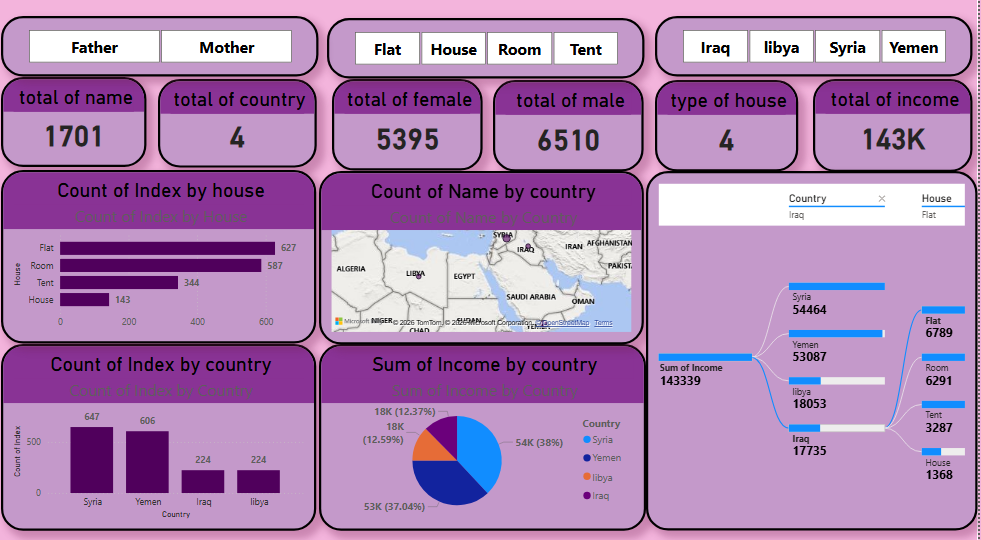
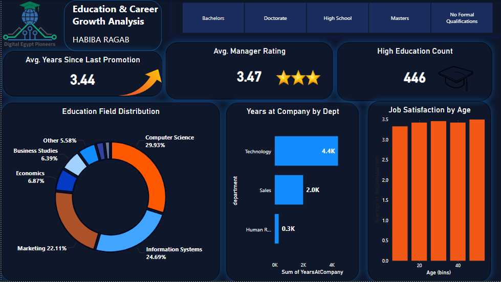

# habiba-portfolio
# Habiba Ragab | Power BI Specialist & Data Analyst 📊

Welcome to my professional portfolio. I specialize in transforming HR and business data into strategic insights through advanced data visualization.

---

### 📉 Project 1: HR Attrition Analysis
This dashboard focuses on employee turnover, analyzing attrition rates by job role, department, and gender diversity to improve retention strategies.

---

### 🌍 Project 2: Global Demographics & Trends
A comprehensive view of global data, visualizing geographic distributions and key demographic metrics across different regions.

---

### 🎓 Project 3: Education and Growth Metrics
Analyzing learning progress and professional development data to track growth and educational milestones within the organization.

---

## 📬 Let's Connect
I am a first-year Information Technology student, passionate about leveraging data to drive decision-making.

- **LinkedIn:** [linkedin.com/in/habibaragab4](https://www.linkedin.com/in/habibaragab4)
- **Email:** [habibaragab482006@gmail.com](mailto:habibaragab482006@gmail.com)
